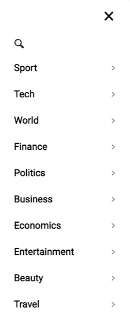
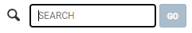
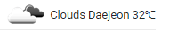

# 🎮 Newyork Times
> 뉴욕타임즈 사이트를 통해 뉴스를 확인해보세요!

Newscatcher api를 사용해 만들었습니다.<br>
실시간 뉴스기사를 접할 수 있습니다.<br><br>
### 보러가기: <https://camac0808.github.io/newyork-times>


## 프로젝트에 사용된 언어 및 라이브러리

* Javascript ES6
* Bootstrap
* Weather api
* Newscatcher api

## 프로젝트의 기능 설명

### 1. sidebar기능을 통해 카테고리별로 분류


### 2. header searchbar 기능, 돋보기 아이콘 누르면 searchbar 


### 3. 반응형 웹


### 4. Weather api 사용하여 날씨 표시


### 5. 하단에 pagination 구현


## 배포
```sh
npm i gh-pages
npm run build
npm run deploy
```

## 향후 업데이트 예정
시간이 너무 지체되서 취업하면서 계속 수정할 예정입니다!

* 반응형 구현
* node.js 활용하여 cache이용. 페이지 뒤로가기 앞으로가기
* 상세페이지 css 꾸미기

## 정보

💌메일 – zqzwzazs@gmail.com - gomgom_@naver.com


## 기여 방법

1. (<https://github.com/camac0808/React-project/fork>)을 포크합니다.
2. (`git checkout -b feature/fooBar`) 명령어로 새 브랜치를 만드세요.
3. (`git commit -am 'Add some fooBar'`) 명령어로 커밋하세요.
4. (`git push origin feature/fooBar`) 명령어로 브랜치에 푸시하세요. 
5. 풀리퀘스트를 보내주세요.

<!-- Markdown link & img dfn's -->
[npm-image]: https://img.shields.io/npm/v/datadog-metrics.svg?style=flat-square
[npm-url]: https://npmjs.org/package/datadog-metrics
[npm-downloads]: https://img.shields.io/npm/dm/datadog-metrics.svg?style=flat-square
[travis-image]: https://img.shields.io/travis/dbader/node-datadog-metrics/master.svg?style=flat-square
[travis-url]: https://travis-ci.org/dbader/node-datadog-metrics
[wiki]: https://github.com/yourname/yourproject/wiki
